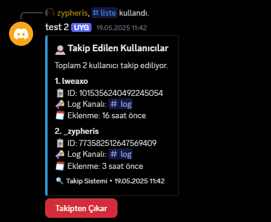
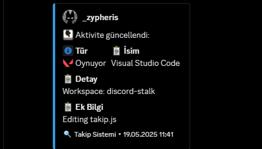
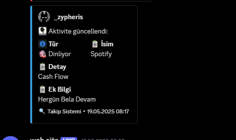
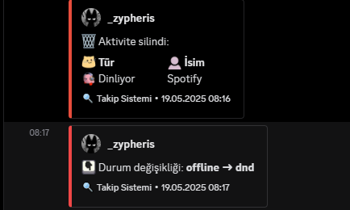

# Botun Örnek görselleri

 
 
 
 

## 📞 İletişim & Destek

### 🌍 **Bize Ulaşın**
Botla ilgili soru ve destek için:

### ❓ **SSS**
#### 🤖 Bot çalışmıyor?
- Node.js v16+ kontrol edin
- `npm install` yapmayı unutmayın
- `node index.js` node . ile çalışmıyorsa yapın

#### 💡 Önerilerim var
Discord sunucumuzda **#öneriler** kanalını kullanın

